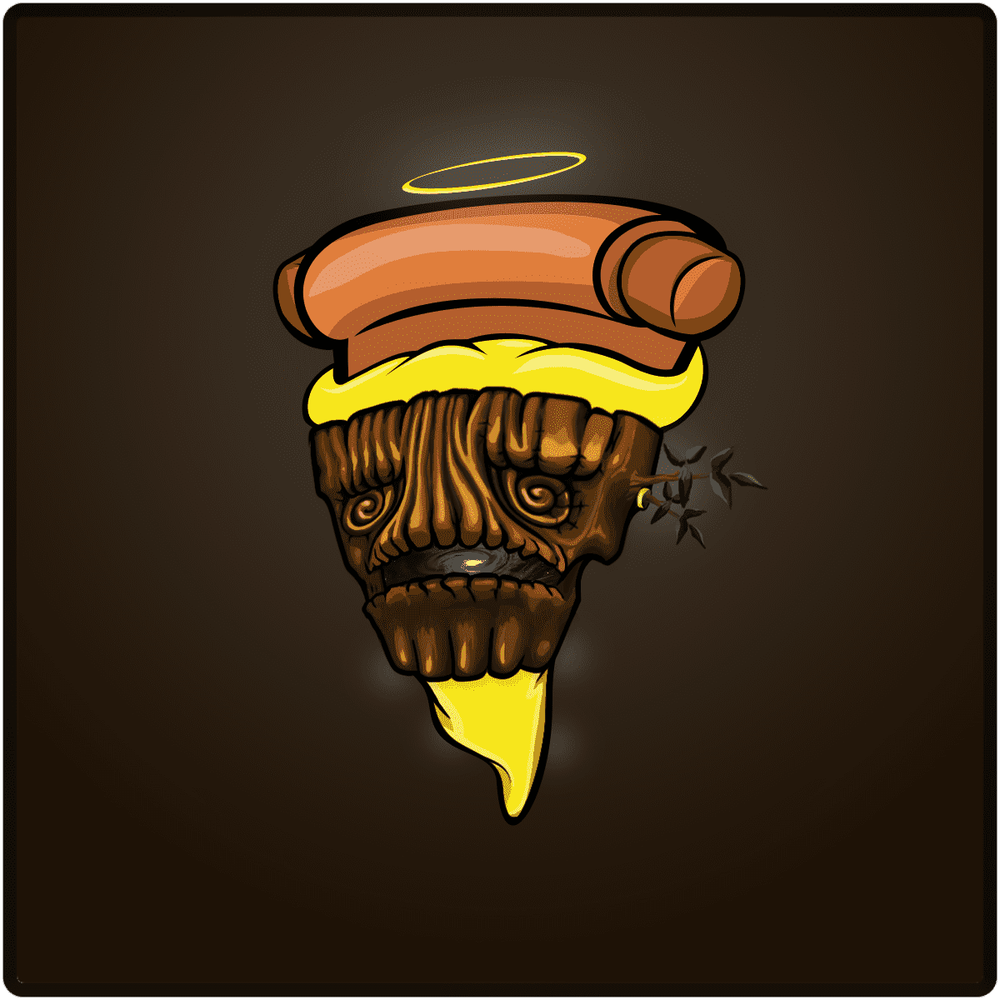

# CryptoPizzaParty

欢迎来到加密披萨派对！！！

每件物品都是独一无二的，由人工智能从 100 多个可能的特征中生成，以创建 10,000 个独特的切片。所有都是特别的，但有些比其他的更罕见。CPP 项目作为 ERC-721 令牌存储在 Polygon 区块链上并托管在 IPFS 上。查看合约详情如果收藏家很挑剔，不要气馁。继续结交朋友，努力工作。有人会买你的艺术品！ <3 <3 <3我们刚刚成功铸造了第 100 个僵尸！现在在 solsea 上抓一个僵尸！

