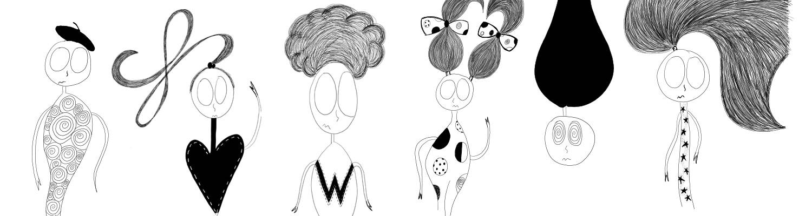

# Crankies

我们是混合思想和困惑的日常情绪。 我们一时兴起，是我们创造者思想的混乱代表。 形状和线条的不完美描绘，我们是 Crankies。

Crankies NFT - 常见问题（FAQ）
▶ 什么是 Crankies？
Crankies 是一个 NFT（不可替代令牌）集合。存储在区块链上的数字艺术品集合。
▶ 有多少 Crankies 代币？
总共有 10 个 Crankies NFT。目前 2 位所有者的钱包中至少有一个 Crankies NTF。
▶ 最近卖出了多少个 Crankies？
过去 30 天内售出 0 个 Crankies NFT。

