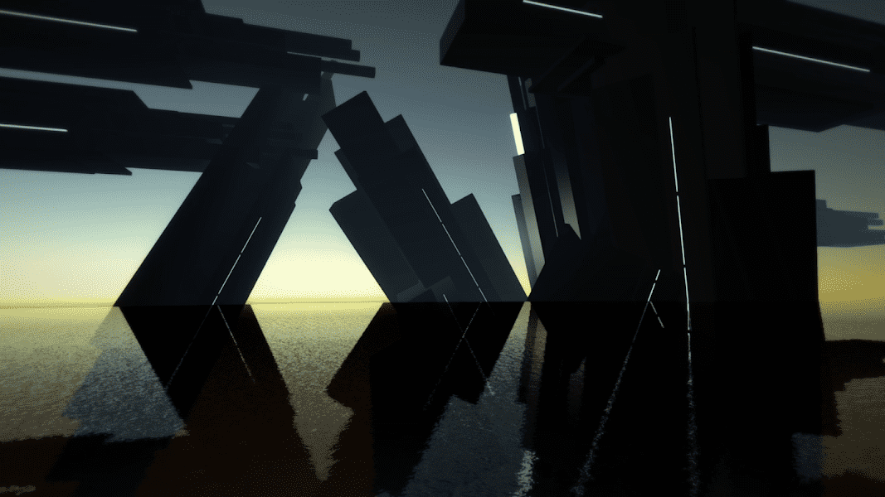

# Crash Archipelago

Crash Archipelago 是一个由 mmmatto.eth 创建的生成视觉和音乐项目。 图像是程序生成的实时 3D 渲染，音频是概率驱动的合成器组合。 每件最终作品均由艺术家亲自挑选。 这是循环过程中的人，而不是原始算法输出。 每个代币都包含一个 xSeed 值，可用于生成未来基于合同的作品。

Crash Archipelago NFT - 常见问题（FAQ）
▶ 什么是崩溃群岛？
Crash Archipelago 是一个 NFT（非同质代币）集合。存储在区块链上的数字艺术品集合。
▶ Crash Archipelago 代币有多少？
总共有 12 个 Crash Archipelago NFT。目前 10 位所有者的钱包中至少有一个 Crash Archipelago NTF。
▶ 最近卖出了多少崩溃群岛？
过去 30 天内售出 0 个 Crash Archipelago NFT。

