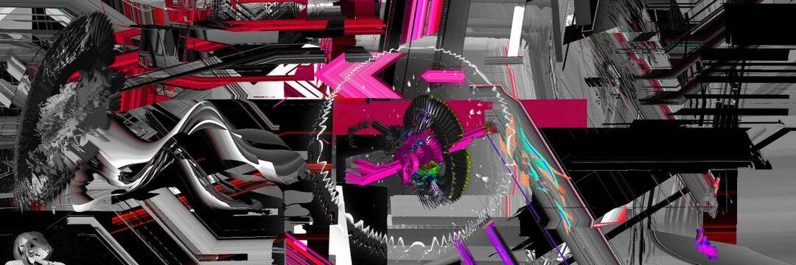

# crash contract

我自己为加密艺术定制的 ERC721 合约。过去 7 天没有卖出任何崩盘合约。速溶花
2月3日
我使用人工智能、故障处理和动态链上代码来制作破裂的数字图像。 将比喻与抽象相结合。 探索我们与元宇宙的锯齿状关系。 由 MOCA、Matt Kane、Claire Silver、BlackBoxDotArt、Rare Scrilla 收藏... 

崩溃合约 NFT - 常见问题（FAQ）
▶ 什么是崩盘合约？
崩溃合约是一个 NFT（Non-fungible token）集合。存储在区块链上的数字艺术品集合。
▶ 崩溃合约代币有多少？
总共有 9 个崩溃合约 NFT。目前 7 位所有者的钱包中至少有一份崩溃合约 NTF。
▶ 最近卖出了多少份崩盘合约？
过去 30 天内卖出了 0 个崩溃合约 NFT。

