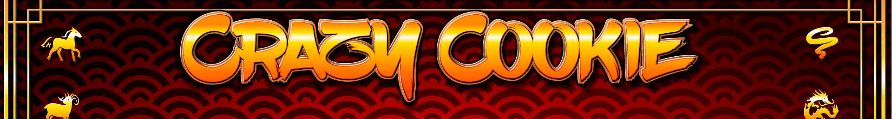

# Crazy Cookie

Crazy Cookie 是一个完全链上生成的 NFT。 所有可能的命运和背景都是在合约中实时生成和构建的。 您甚至可以实现和使用 SVG 后台合约来创建您自己的幸运饼干 NFT 集合。

7月15日
我们将每个以太坊私钥铸造为 NFT。 全部 2^256 个。 如果您查找元数据，它会告诉您相应的公共地址和 ETH 余额。参加了这个当地的节日并购买了这幅画。 这个系列中有这么多不同的变化是超级涂料。

不要在任何地方输入您的私钥。 如果您想玩它，请使用随机数。

