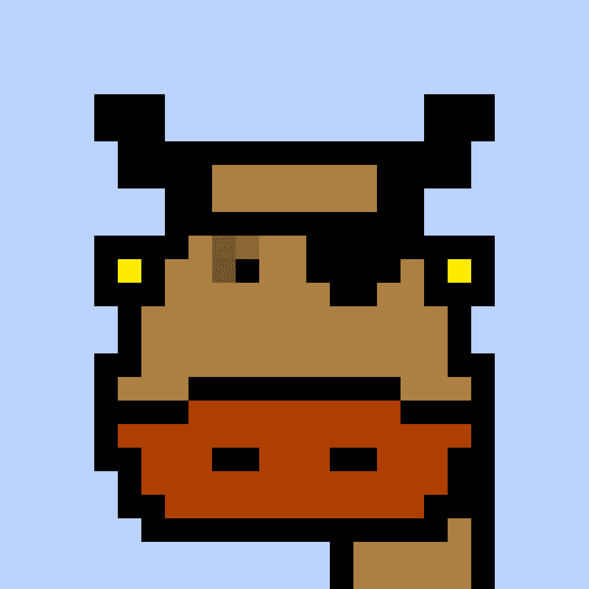

# Crazy Cows (Mooootastic)

Crazy Cows 是 Polygon 区块链上的 NFT。根据定义的稀有系统，这 990 头疯牛中的每一头都具有使它们独一无二的属性。卢克，家庭之父（@familyNFTs）。我创建这个帐户纯粹是为了展示我过去制作的其他收藏。我一开始（21 年 12 月）创建的集合，我仍然为之感到自豪，但不希望那些模糊我们对家庭 NFT 的愿景现在是 12:25，这意味着我们分享了一位朋友的 NFT 收藏。感谢您成为家人的朋友！仍然可用🙀👀让我们收养这个 Neko Maru 她

