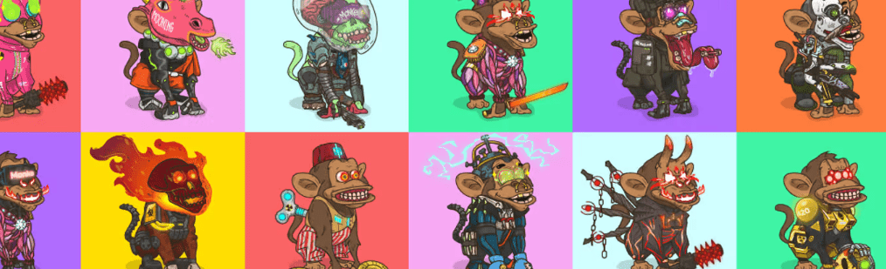

# Crazy Monke

3000 个 Crazy Monkeys 是由 140 多个特征的随机组合以编程方式生成的。 Carzy Monkeys 以 ERC-721 代币的形式存在于以太坊区块链上，并托管在 IPFS 上。 每个 Monke 都是独一无二的，但有些特征比其他特征更罕见。

Crazy Monke NFT - 常见问题（FAQ）
▶ 什么是疯僧？
Crazy Monke 是一个 NFT（非同质代币）集合。存储在区块链上的数字艺术品集合。
▶ Crazy Monke 代币有多少？
总共有 3,000 个 Crazy Monke NFT。目前，315 位所有者的钱包中至少有一个 Crazy Monke NTF。
▶ 最贵的 Crazy Monke 拍卖会是什么？
售出的最昂贵的 Crazy Monke NFT 是 MONKE #190。它于 2022-06-11（3 个月前）以 5.6 美元的价格售出。
▶ 最近卖了多少个疯猴？
过去 30 天内售出 1 个 Crazy Monke NFT。

