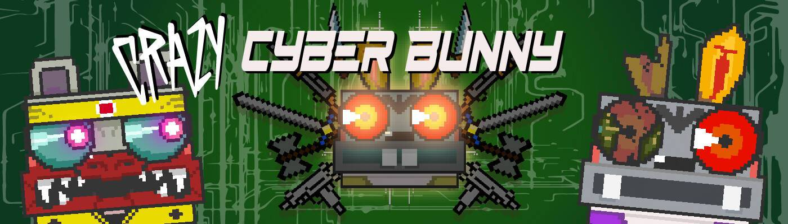

# CrazyCyberBunny

揭示 17.07.2021开发阶段的育种系统！ 1+1=3 持有者免费武器！20 000 个独特的 NFT 角色，由以太坊区块链提供支持。 已验证的智能合约。 ERC-721 标准。 游戏机制：与 Cyber Arena 对战，ETH 赌注（开发）。那是 2023 年，期待已久的伦敦硬分叉更新。 区块链中的所有生物都耐心地等待从拥挤的网络中解放出来。 过去十年紧张局势升级，网络生物处于沸点。他们等待自由。 硬分叉更新是他们的救赎。在 2023 年冬天，更新如期而至，但以太坊网络的一个缺陷引发了前所未有的恐怖。 网络的扩张打开了网络地狱的闸门。

