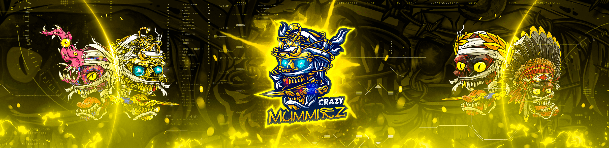

# CrazyMummiezProject

CrazyMummiez 是 2,804 个独特的、随机生成的从死亡中复活的木乃伊的集合，他们希望以 ERC-721 NFT 的形式为地球带来永恒的黑暗。CrazyMummiez 已经释放了他们令人心碎的呐喊，并希望将来自深处的腐烂和泥土带到地球 他们的灵魂已被埋葬。CrazyMummiez 和它的 2 个相关项目 CrazySkullz 和 NUKES 现在是社区运行的，将托管在新的

CrazyMummiezProject NFT 在过去 7 天内售出 26 次。CrazyMummiezProject 的总销售额为 859.36 美元。CrazyMummiezProject NFT 的平均价格为 33.1 美元。CrazyMummiezProject 共有 1,161 名所有者，总共拥有 2,804 个代币。

