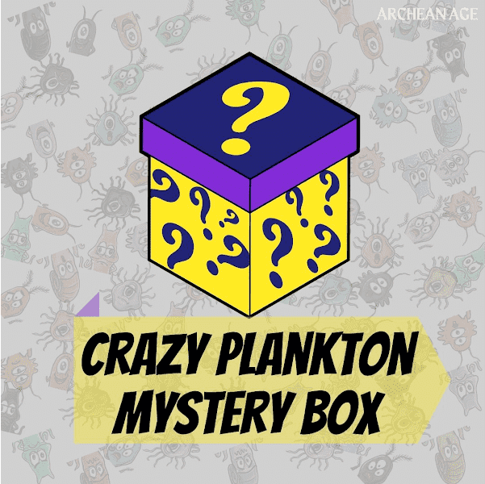

# Crazy Plankton Archean

1000 个太古宙浮游生物神秘盒子销售至 2022 年 3 月 20 日关于起源请参考这里 https://opensea.io/collection/crazyplanktongenesis 路线图我们参考这里 https://en.wikipedia.org/wiki/Geologic_time_scale

Crazy Plankton Archean NFT - 常见问题（FAQ）
▶ 什么是疯狂的浮游生物？
Crazy Plankton Archean 是一个 NFT（非同质代币）集合。存储在区块链上的数字艺术品集合。
▶ 有多少 Crazy Plankton Archean 代币？
总共有 1,000 个 Crazy Plankton Archean NFT。目前，45 位所有者的钱包中至少有一个 Crazy Plankton Archean NTF。
▶ 最近卖出了多少疯狂浮游生物？
过去 30 天内售出 0 个 Crazy Plankton Archean NFT。

