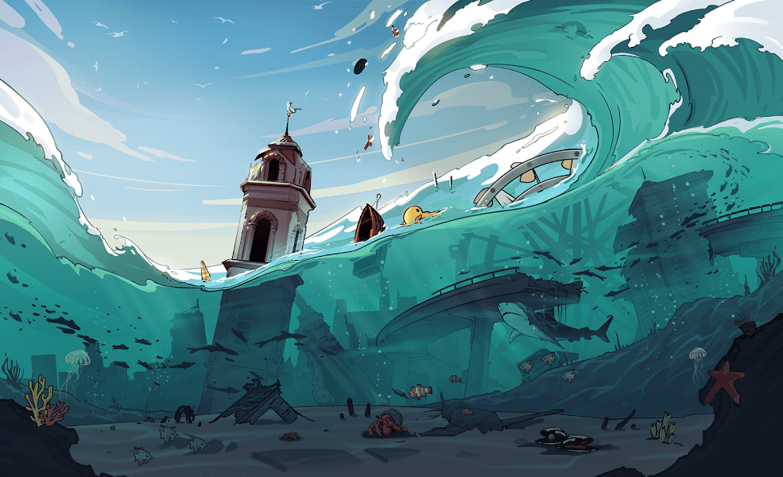

# CrazySeaNFT

2071 年，温室气体排放（主要是二氧化碳）失控。 地球的温度上升，两极的冰大量融化，海洋表面上升并变得汹涌。 许多曾经辉煌的城市都被淹没了。 在疯狂的海中，我们航行到更高的山脉，或者更确切地说，孤岛。 回顾我们的生活，我们意识到，正是那些我们曾经引以为豪的富裕生活，才为当前的苦难埋下了伏笔。 经过认真思考，我们返回并使用 NFT 与您交流。 如果您在 2022 年在 NFT 市场中遇到这个故事的片段，请珍惜它。Twitter：

