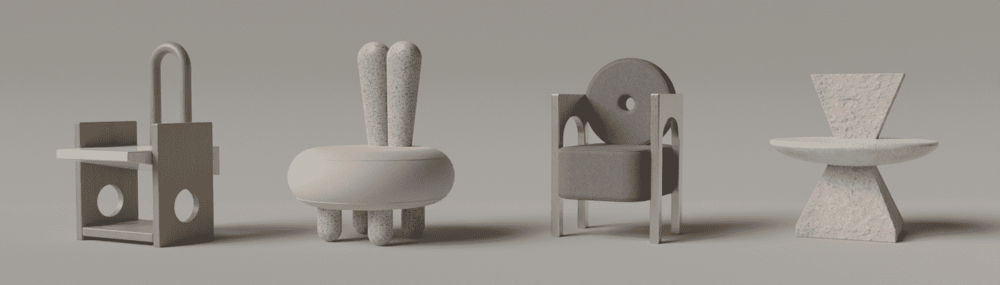

# CreaChairs

CreaChairs 是一系列由 1,000 个程序生成的数字椅子。每个 CreaChair 都是一个与 Metaverse 应用程序完全兼容的 3D 对象。

CreaChairs NFT - 常见问题（FAQ）
▶ 什么是 CreaChairs？
CreaChairs 是一个 NFT（非同质代币）集合。存储在区块链上的数字艺术品集合。
▶ 有多少个 CreaChairs 代币？
总共有 38 个 CreaChairs NFT。目前，18 位所有者的钱包中至少有一个 CreaChairs NTF。
▶ 最近卖出了多少 CreaChair？
过去 30 天内售出 0 个 CreaChairs NFT。

- .1 ETH 铸币厂
- 6 种不同的材料
- 1,000 个程序生成的椅子（目前）
- 20 个 OG 椅子（赠送给 OG 贡献者）
- 8 个拍卖的幸运椅（作为真正的椅子建造）

什么是 CreaChair？

每个 CreaChair 都是一个程序生成的艺术品，存在于收藏家具和当代雕塑之间。这些椅子不是图像，而是 Metaverse 就绪的 3D 模型。

当您铸造 CreaChair 时，您将收到其封面图像和 .GLB 文件。这个数字文件可以在我们的美学门户上查看，但您也可以将其移植到其他 Metaverse

