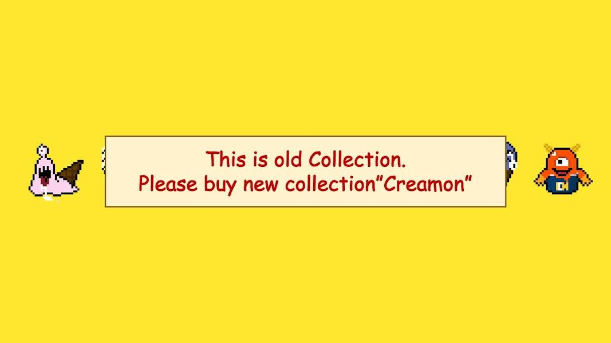

# Creamons

不要买！！！！这是旧收藏。NEW COLLECTION↓ https://opensea.io/collection/creamon手绘纯链上NFT慈善收藏。Creamons想让世界微笑。谁太穷了吃冰激凌，所以他们决定把销售额的20%捐出来帮助解决贫困，他们的口号是“No Poverty”，全链条慈善类型的NFT收藏。 将制作10,000个手绘“Creamons”！ Creamons是善良的怪物，他们竭尽全力向无法吃冰淇淋的贫困儿童捐款，让他们知道冰淇淋有多好吃。 包括二次分销费在内的20%的销售额将捐赠给贫困问题。

 请购买“Creamon”。NFT - 常见问题（FAQ）
▶ 什么是Creamons(旧系列) 请购买“Creamons”。？
Creamons（旧系列） 请购买“Creamon”。是一个 NFT（不可替代代币）集合。存储在区块链上的数字艺术品集合。
▶ 多少Creamons（旧收藏）请购买“Creamon”。代币存在吗？
总共有 50 个 Creamons（旧系列）请购买“Creamon”。NFT。目前 4 位业主至少有一个 Creamons（旧系列）请购买“Creamon”。NTF 在他们的钱包里。
▶ 多少Creamons（旧收藏）请购买“Creamon”。最近有卖吗？
共有 0 个 Creamons(旧系列) 请购买“Creamons”。过去 30 天内售出的 NFT。

