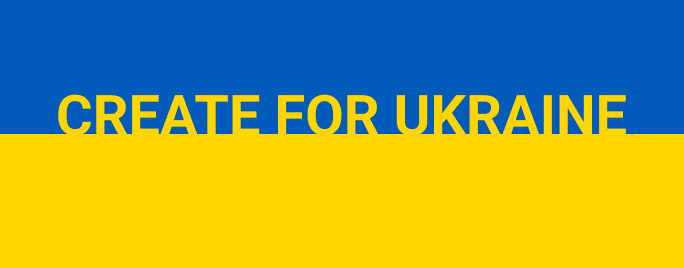

# CREATE FOR UKRAINE

为乌克兰创作是 NFT 艺术家社区发起的一项小型倡议，其中一组艺术家捐赠了他们的艺术作品以支持受乌克兰战争直接影响的人们。我们将捐赠给：1) https://twitter.com/ 红十字会乌克兰
2) https://twitter.com/乌克兰
3) https://twitter.com/Unchainfund 所有一级和二级销售额的100%将捐赠给上述机构。

CREATE FOR UKRAINE NFT - 常见问题（FAQ）
▶ 什么是 CREATE FOR UKRAINE？
CREATE FOR UKRAINE 是一个 NFT（非同质代币）集合。存储在区块链上的数字艺术品集合。
▶ 有多少 CREATE FOR UKRAINE 代币？
总共有 144 个 CREATE FOR UKRAINE NFT。目前，32 位所有者的钱包中至少有一个 CREATE FOR UKRAINE NTF。
▶ CREATE FOR UKRAINE 最近卖出了多少？
在过去 30 天内售出了 0 个 CREATE FOR UKRAINE NFT。

