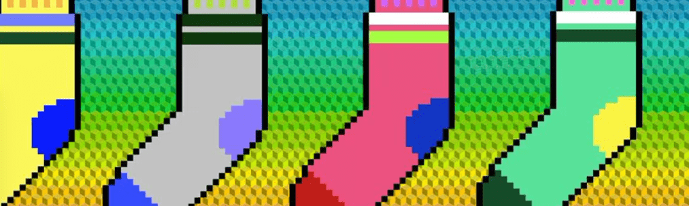

# creativeSocks

🧦圣诞节前我们为你准备了 7,700 只创意袜子

CWS 社区代币授予访问连接 NFT 社区和我们正在开发的主要艺术家/品牌合作的独家和令人兴奋的掉落。我们重视通过清晰和深思熟虑的战略镜头精心打造的相关、发自内心的互动。与我们这个时代一些最有影响力的艺术和创意人士合作，我们正在建立一个社区，目标是创建一个由收藏家和合作者组成的生态系统，从而带来机会和经验来奖励那些支持者。

创意工作室。NFT 在过去 7 天内售出 2 次。creativeSocks 的总销量。是 193.4 美元。一个creativeSocks 的平均价格。NFT 为 96.7 美元。有799个creativeSocks。所有者，总共拥有 5 个代币。

