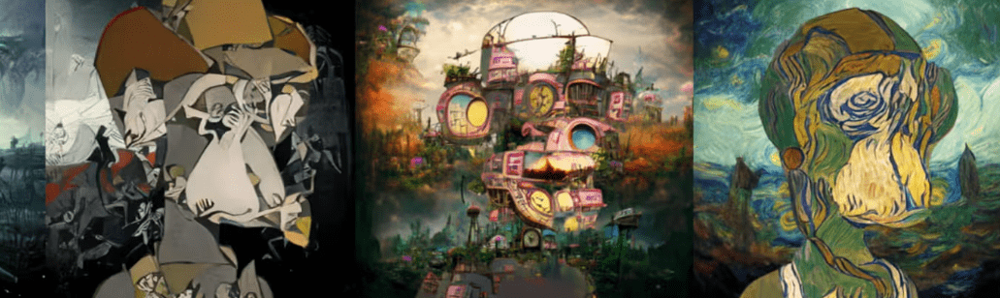

# CreatureFantasy

今天，我们通过介绍 Creature Fantasy NFT 系列来揭开 SOMETHING Adventurous 的面纱，该系列由一系列与 AI 混合的神秘生物以及从 SOMETHING NFT 中精选出的心爱元素组成。 我们一起以某事结束。

CreatureFantasy NFT - 常见问题（FAQ）
▶ 什么是 CreatureFantasy？
CreatureFantasy 是一个 NFT（非同质代币）集合。存储在区块链上的数字艺术品集合。
▶ 有多少个 CreatureFantasy 代币？
总共有 1,681 个 CreatureFantasy NFT。目前，105 位所有者的钱包中至少有一个 CreatureFantasy NTF。
▶ 最昂贵的 CreatureFantasy 销售是什么？
最昂贵的 CreatureFantasy NFT 是 CF #1215。它于 2022 年 6 月 20 日（2 个月前）以 11 美元的价格出售。
▶ 最近卖出了多少 CreatureFantasy？
过去 30 天内售出了 1 个 CreatureFantasy NFT。

