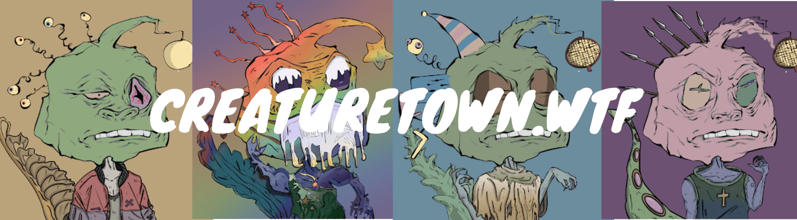

# creaturetown.wtf

MINT HERE 先免费 1k，然后每 NFT 0.0069。 每笔交易 10 个，每个钱包 30 个！ 立即揭晓 生物城 yoo sniksnakr DEJEN 老鼠 oooooh 老鼠是 yummmz dis a NEFTEEE O Creatures on da BLOKCHIN wat？ 哦。 crustybutt da creativeking 说 GEE EMMM DEDJEN RUTS an queenie saay HLLO SWEATIES ok dats all byeby

creaturetown.wtf NFT 在过去 7 天内售出 86 次。creaturetown.wtf的总销售额为 $38.82k。一份 creaturetown.wtf NFT 的平均价格为 451.4 美元。有 6,183 名 creaturetown.wtf 所有者，拥有 10,000 个代币的总供应量。

