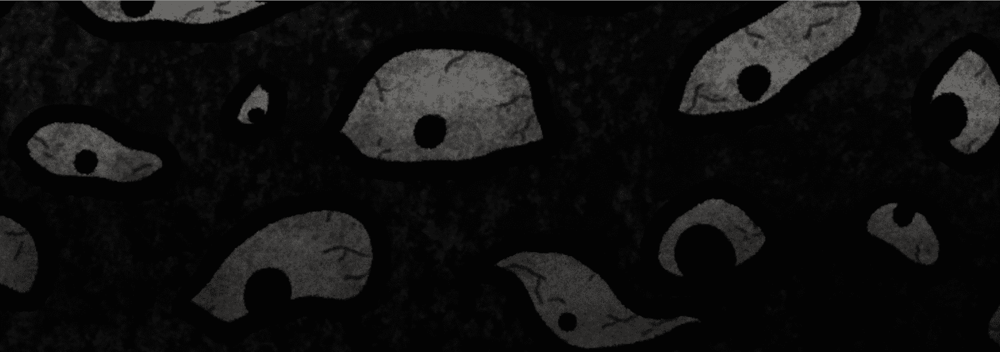

# Creepies: Uncanny Valley

Creepies 是来自 Uncanny Valley 的 6666 个 NFT 朋友的集合，由 casanova.frankenstein 博士从 100 多个手绘元素中随机生成。 他们来这里是为了和你一起玩游戏。铸币和持有 Creepies NFT 使你有权获得未来的免费掉落、我们限量版实体棋盘游戏的副本，它带有自己的 NFT，以及更多未来的福利！ 但是快点！ 未铸造的 Creepies 将被烧毁……即使是 1/1s！

Creepies: Uncanny Valley NFT - 常见问题（FAQ）
▶ 什么是Creepies: Uncanny Valley？
Creepies: Uncanny Valley 是一个 NFT（非同质化代币）集合。存储在区块链上的数字艺术品集合。
▶ 有多少个Creepies: Uncanny Valley代币？
总共有 16 个Creepies: Uncanny Valley NFT。目前 6 位所有者的钱包中至少有一个stick.venom NTF。
▶ 最近卖了多少Creepies: Uncanny Valley？
过去 30 天内售出 0 个Creepies: Uncanny Valley NFT。

