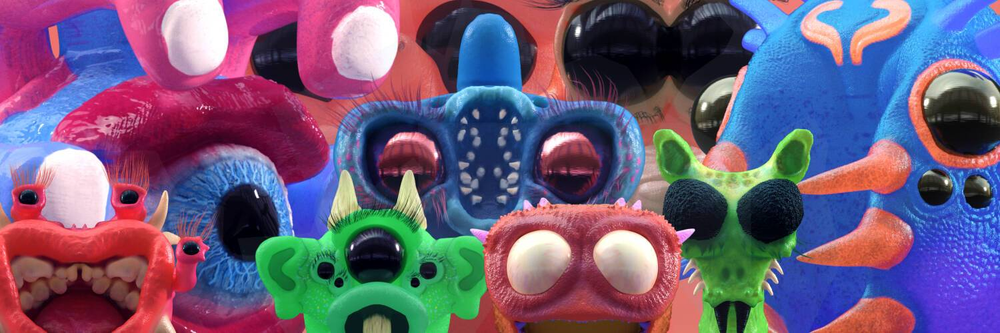

# CREEPTURES

Creeptures 的新定制家园！Creeptures 是独一无二的手工雕刻和彩绘 3D 怪物。 从头开始创建，不使用预制资产或模板，这些是在带有 Nomad 的 iPad 上雕刻的，然后通过添加更多细节、动作、纹理和光线在 Houdini 中栩栩如生。

CREEPTURES NFT - 常见问题（FAQ）
▶ 什么是 CREPTURES？
CREEPTURES 是一个 NFT（不可替代代币）集合。 存储在区块链上的数字艺术品集合。
▶ 存在多少 CREEPTURES 代币？
总共有 712 个 CREEPTURES NFT。 目前，193 位所有者的钱包中至少有一个 CREEPTURES NTF。
▶ 最昂贵的 CREEPTURES 销售是什么？
出售的最昂贵的 CREEPTURES NFT 是 #21 Ajna #16/25。 它于 2022 年 6 月 17 日（2 个月前）以 312.9 美元的价格售出。
▶ 最近卖出了多少 CREEPTURES？
过去 30 天内售出了 5 个 CREEPTURES NFT。
▶ 什么是流行的 CREEPTURES 替代品？
拥有 CREEPTURES NFT 的用户还拥有 NFTfolio、ART2PEOPLE x Mercedes-Benz、henrysdev & AMNDA 的 Isodre 和 Exclusible GoldAlpha。

