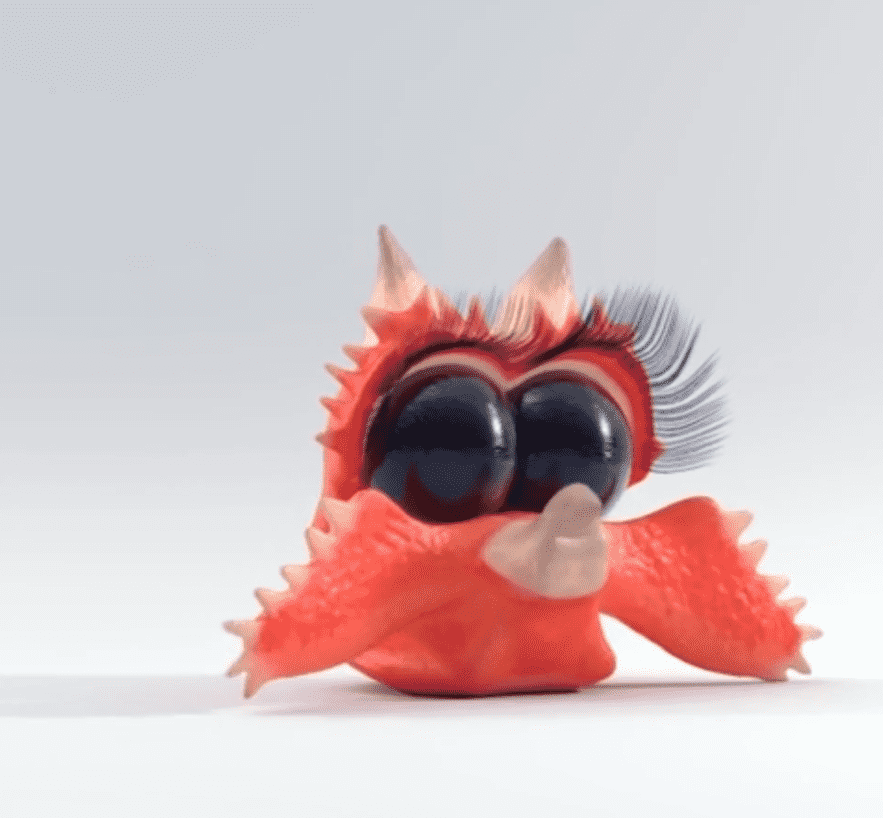

# Creeptures

Creeptures 是独一无二的手工雕刻和彩绘的 3D 怪物。从头开始创建，不使用预制资产或模板，这些是在带有 Nomad 的 iPad 上雕刻的，然后通过添加更多细节、动作、纹理和光线在 Houdini 中栩栩如生。常问问题我能得到什么？除了无缝循环、看起来很酷的 NFT 之外，还有一些特殊的可解锁内容：用作头像的静态图片 在 MetaVerse 中使用的 3D 文件 Mp4 和 Gif 文件可在社交媒体中灵活运用 早期访问未来限量版下降的机会我应该买吗？想象一下 NFT 和所有 Cryptos 都将归零，你还会为拥有 CREEPTURE 感到高兴吗？

