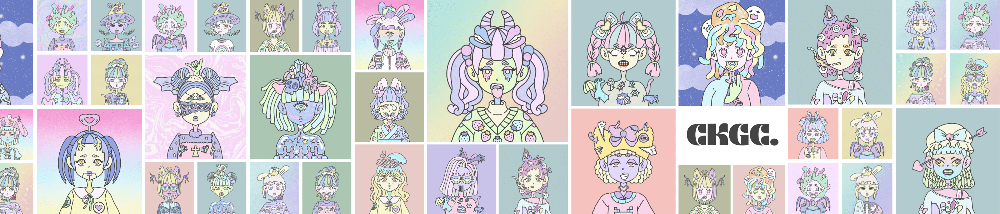

# Creepy Kawaii Girl Club

令人毛骨悚然的卡哇伊女孩俱乐部诞生于日本的卡哇伊文化和令人毛骨悚然的可爱柔和哥特风格的结合。 拥有超过 1000 件令人毛骨悚然的卡哇伊女孩的艺术作品。我所有的艺术都是从画公主和恐龙来招待我年轻的妹妹和弟弟。++++++++++++++++++++++++++ +++++++++++++++++01 - #200 ------------ 0.01 ETH201 - #300 ------------ 0.015 ETH301 - #500 ------------ 0.02ETH501 - ------------ 尚未修复稀有物品将 +0.01 所有持有者（主要分配）将获得特别感谢 NFT 项目。 他们将自动注册任何赠品活动。 并且可以加入“仅持有者赠品活动 = 3D 和动画可能包括！” 也！ 如果你至少从CKGC#1-1000获得了一个NFT，你可以在收集5个或更多之后申请超级稀有物品！ 如果你从第 2 季获得了一个，你可以从 10 个或更多申请！！！

令人毛骨悚然的 Kawaii Girl Club NFT 在过去 7 天内售出 13 次。Creepy Kawaii Girl Club 的总销售额为 340.32 美元。一个 Creepy Kawaii Girl Club NFT 的平均价格为 26.2 美元。有 160 名令人毛骨悚然的卡哇伊女孩俱乐部所有者，拥有 372 个代币的总供应量。

