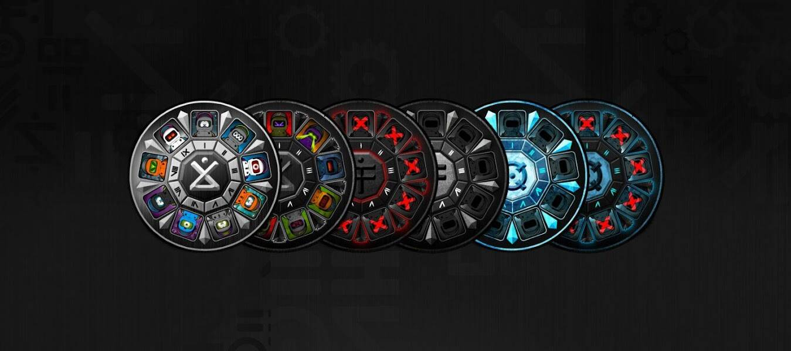

# CREW Coins

一个完全互动的 qNFT，适合 X/DOJI 收藏家，他们设法将所有等级聚集在一个派系中。 每个 CREW 硬币代表 9 个 X/DOJI 以非托管方式集合在一起，这意味着您可以持有您的 X/DOJI 并获得硬币的所有好处。 每个硬币都会为其中包含的每个 X/DOJI 解锁额外的特权，毕竟作为 CREW，你比个人更强大。

CREW Coins NFT - 常见问题（FAQ）
▶ 什么是 CREW 硬币？
CREW Coins 是一个 NFT（非同质代币）集合。存储在区块链上的数字艺术品集合。
▶ 存在多少 CREW Coins 代币？
总共有 29 个 CREW Coins NFT。目前，19 位所有者的钱包中至少有一个 CREW Coins NTF。
▶ 最近卖出了多少 CREW 硬币？
过去 30 天内共售出 0 个 CREW Coins NFT。

