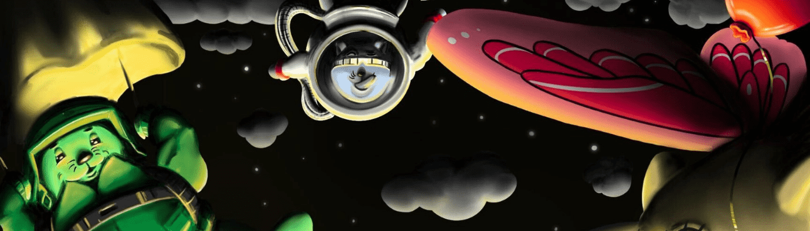

# Cribbo Genesis

一个独特的 4050 手绘麻烦制造者 (Cribbies) 集合，它们在 Metaverse 中有趣地代表了我们的角色。 每个 Cribby 都授予对独家应用内 + IRL 特权的访问权限。Alpha 访问 Cribbo 应用程序 | 2. Beta 访问新功能 | 3. 刻录实用程序（即将推出）| 4. 获得未来掉落 | 5. 商品（即将推出）| 6. IRL 聚会（很快）应用程序：https://cribbo.com

Cribbo Genesis NFT - 常见问题（FAQ）
▶ 什么是 Cribbo Genesis？
Cribbo Genesis 是一个 NFT（非同质代币）集合。存储在区块链上的数字艺术品集合。
▶ 有多少 Cribbo Genesis 代币？
总共有 903 个 Cribbo Genesis NFT。目前，187 位所有者的钱包中至少有一个 Cribbo Genesis NTF。
▶ 最近卖出了多少 Cribbo Genesis？
过去 30 天内售出 0 个 Cribbo Genesis NFT。

