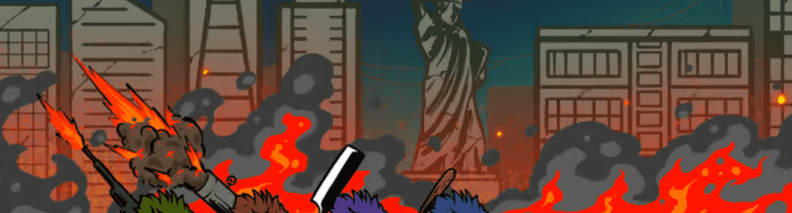

# Critterstown Official

7777 只小动物回到地球上破坏浩劫！ ETH 上的免费薄荷糖！50% 的 OPENSEA 收入将用于购买 Critterstown Official NFTS，并将使用经过验证的公平随机数生成器随机抽奖给 HOBGOBLIN 持有者

👾破坏性和淘气的 Web3 生物的混合体👾

💥小动物接管是不可避免的💥

免费获取小动物并加入社区

供应量：0/7,777（每笔 5 个）

这个铸币厂将花费你 0 ETH

官方 Critterstown Official NFT 在过去 7 天内售出 8 次。Critterstown Official 的总销售额为 8.23 美元。一份官方 Critterstown Official NFT 的平均价格为 1 美元。有 4,812 名 Critterstown Official官方所有者，总供应量为 10,000 个代币。

