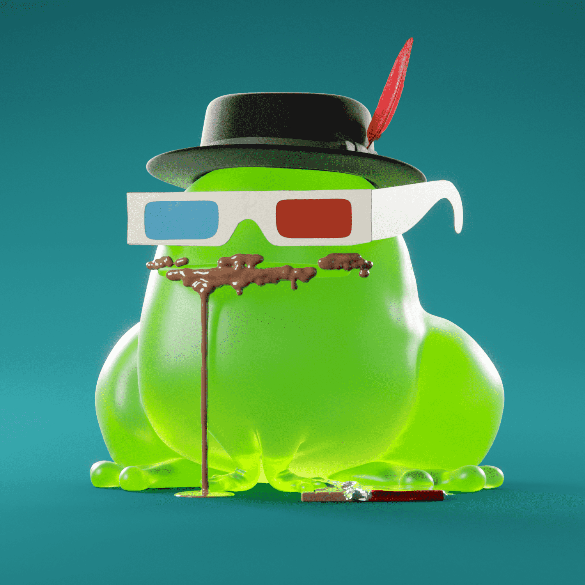

# CROAKZ by McGill!

CROAKZ 是 6969 种小型两栖动物的集合，它们在沼泽中活动并在月球上呱呱叫。每一款 CROAK 都具有精雕细琢的卓越感觉，并展现出一种让想象力充满奇迹的艺术性。其中一些可以舔，但当然建议谨慎。CROAKZ 的灵感来自 CrypToadz，并将在元宇宙和肉类空间中蓬勃发展。质量第一。CROAKZ 将拥有精雕细琢的卓越感。达到这个标准的范围超出了 CROAKZ 薄荷糖。当我们接近元宇宙时，机会是无穷无尽的。所以让我们准备好跳跃吧！一旦我们的团队认为 CROAKZ 系列达到并超出了我们的标准和期望，我们将立即公布薄荷的详细信息。

