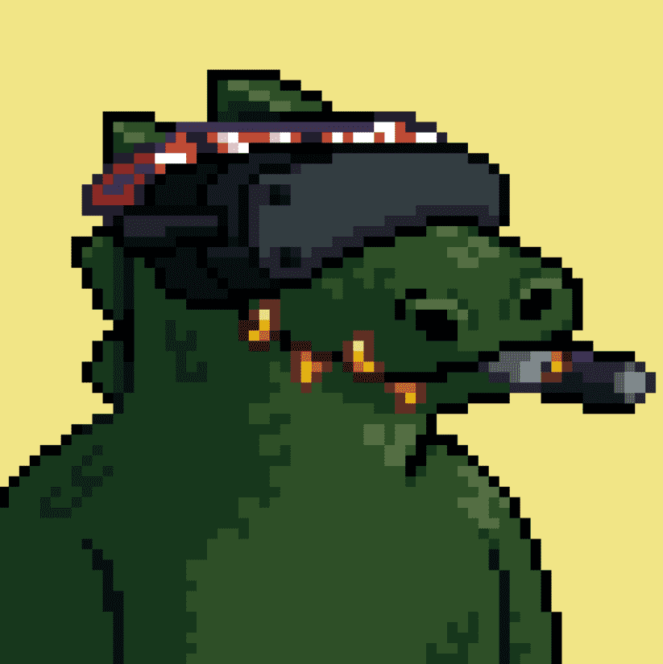

# CrocZ

CrocZ 是 1,111 个独特且随机生成的 NFT 在 $SWAMP 上闲逛的集合。CrocZ 将为持有者提供我们的原生 $Swamp 代币。代币将没有流动性对，但将以看似无穷无尽的效用形式为我们的持有者提供无穷无尽的价值。1,555 只 Genesis CrocZ 在沼泽地闲逛，未来还有 777 只婴儿。每个 Croc 每天都会产生 $SWAMP，这是在 CrocZ 生态系统中看似无穷无尽的效用的门票。*日程*销售将于 2022 年 12 月 19 日凌晨 5:49 GMT+8结束 经过 1,555 只 Genesis CrocZ 在沼泽地闲逛，未来还有 777 只婴儿。每个 Croc 每天都会产生 $SWAMP，这是在 CrocZ 生态系统中看似无穷无尽的效用的门票。

