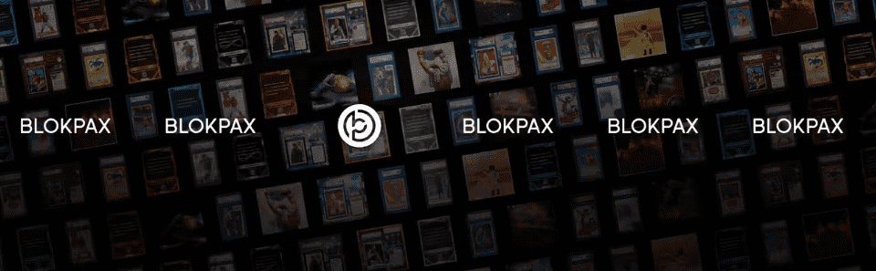

# Crowd Slabs by Blokpax

Crowdslabs 在 Blokpax 生态系统中作为免费质押奖励分发。 Blokpax 不销售 Crowdslabs。 Crowdslabs 持有者可以分享标志性的交易卡。 底层卡将被拍卖为我们未来的生态系统实用代币 BPX。 然后，该 BPX 将按比例分配给 Crowdslabs 持有者（他们可以在未来的拍卖或整个生态系统中自己使用 BPX）。 重要提示：BPX 在 Blokpax 生态系统中没有其他功能，并且不能从 Blokpax 购买。 Blokpax 不提供或打算提供 BPX 的二级市场。

Blokpax NFT 的 Crowdslabs 在过去 7 天内售出 10 次。Blokpax 的 Crowdslabs 的总销售额为 360.59 美元。Blokpax NFT 的一个 Crowdslabs 的平均价格为 36.1 美元。Blokpax 所有者有 440 个 Crowdslab，总共拥有 23 个代币。

