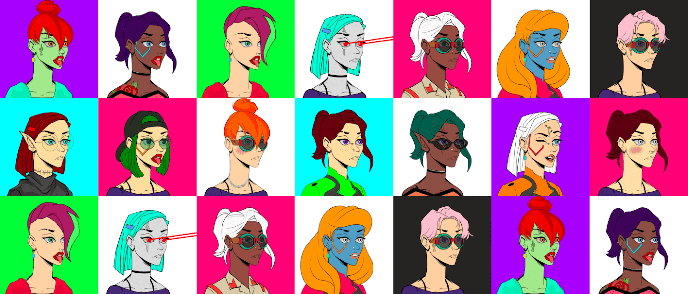

# Crowns For Ladies

每个女士都需要一顶王冠。 Crowns 是 Fame Lady Squad 持有者的衍生艺术。

NFT 女士皇冠 - 常见问题 (FAQ)
▶ 什么是女士皇冠？
Crowns For Ladies 是一个 NFT（非同质代币）系列。存储在区块链上的数字艺术品集合。
▶ 有多少 Crowns For Ladies 代币？
女士 NFT 总共有 6,132 个 Crowns。目前，1,810 位车主的钱包中至少有一个 Crowns For Ladies NTF。
▶ 最近卖出了多少枚女士皇冠？
过去 30 天内售出 0 个 Crowns For Ladies NFT。
▶ 有哪些流行的女士皇冠替代品？
许多拥有 Crowns For Ladies NFTs 的用户还拥有 EL NUMEROS、 DegenOkayBears、 WaterBe4nZukis和 Old Legacy。

