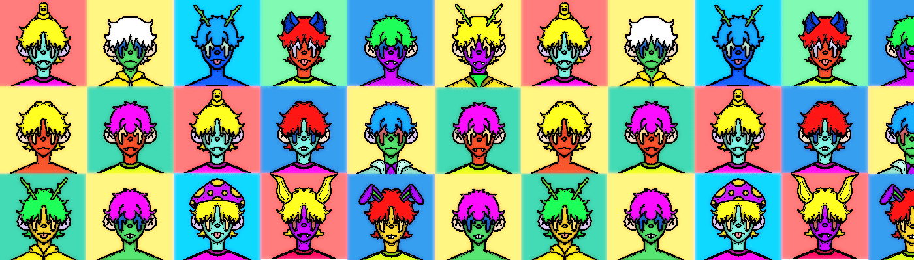

# CrypDudz

CrypDudz 是托管在 Polygon 区块链上的 1,250 个独特的“Dudz”的集合。 每个 CrypDudz 都有 8 个属性； 背景、皮肤、耳朵、眼睛、头发、头部、嘴巴和衣服。该系列包含 10 个基于主题的限量版 CrypDudz，每个都有特殊的 1/1 特征。所有 1,250 个 CrypDudz，包括现在发布的限量版！查看我们的 CryptDeadz 配套项目原始 CrypDudz Gen1 系列仍然可用

CrypDudz NFT - 常见问题（FAQ）
▶ 什么是 CrypDudz？
CrypDudz 是一个 NFT（不可替代令牌）集合。存储在区块链上的数字艺术品集合。
▶ 有多少 CrypDudz 代币？
总共有 1,250 个 CrypDudz NFT。目前，228 位所有者的钱包中至少有一个 CrypDudz NTF。
▶ 最近卖出了多少 CrypDudz？
过去 30 天内共售出 0 个 CrypDudz NFT。
▶ 什么是流行的 CrypDudz 替代品？
许多拥有 CrypDudz NFT 的用户还拥有 Harika Landscapes、 Sharks Metaverse、 Zombie Bitsons和 The Bitsons Collectibles。

