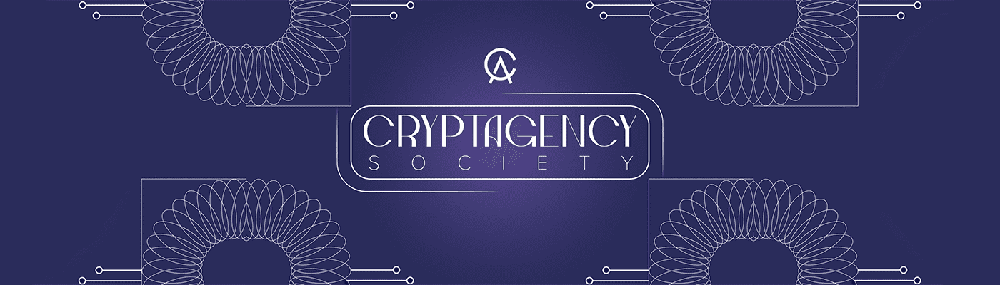

# CryptAgency Society

拥有 1000 名会员的公司，突破 NFT 和艺术的界限。会员资格让您可以访问私人社区，获得独家信息、NFT 领域文章、趋势项目报告、NFT 收藏白名单，甚至为幸运者免费赠送.

CryptAgency Society NFT - 常见问题（FAQ）
▶ 什么是 CryptAgency 协会？
CryptAgency Society 是一个 NFT（不可替代代币）集合。存储在区块链上的数字艺术品集合。
▶ 存在多少 CryptAgency Society 代币？
总共有 1,000 个 CryptAgency Society NFT。目前，459 位所有者的钱包中至少有一个 CryptAgency Society NTF。
▶ CryptAgency Society 最昂贵的交易是什么？
最昂贵的 CryptAgency Society NFT 是 CryptAgency Society。它于 2022 年 6 月 26 日（2 个月前）以 22 美元的价格售出。
▶ 最近卖出了多少 CryptAgency Society？
过去 30 天内售出了 1 个 CryptAgency Society NFT。

