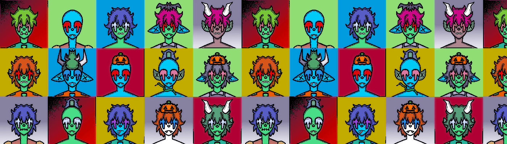

# CryptDeadz - The Undead Collection

CryptDeadz 是托管在 Polygon 区块链上的 1,666 个独特的“Dead Dudz”的可怕集合。 CrypDudz 的配套集合 每个 CryptDeadz 都有 8 个属性； 背景、皮肤、耳朵、眼睛、头发、头部、嘴巴和衣服。

CryptDeadz - The Undead Collection NFT - 常见问题（FAQ）
▶ 什么是 CryptDeadz - 亡灵系列？
CryptDeadz - Undead Collection 是一个 NFT（不可替代令牌）集合。存储在区块链上的数字艺术品集合。
▶ 存在多少 CryptDeadz - The Undead Collection 代币？
总共有 1,664 个 CryptDeadz - The Undead Collection NFT。目前，215 位所有者的钱包中至少有一个 CryptDeadz - The Undead Collection NTF。
▶ 最近卖出了多少 CryptDeadz - The Undead Collection？
过去 30 天内共售出 0 个 CryptDeadz - The Undead Collection NFT。

