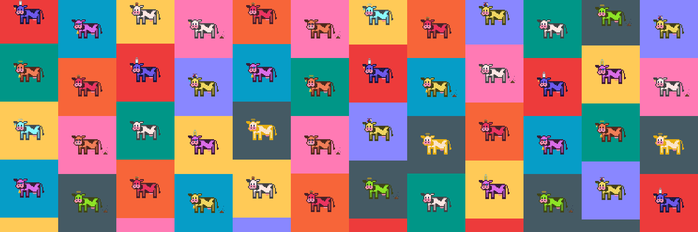

# Cryptic Cows

3,333 头神秘奶牛在以太坊区块链上放牧。 每头牛都授予对 DAO 独家社区的访问权和对 DAO 资产的投票权。

CryptoCows NFT - 常见问题（FAQ）过去 7 天内没有出售任何 CryptoCows。2018 年和 2019 年的 CryptoCows 是 CryptoToons 家族的一部分——这是一个独特的项目，将区块链与卡通乐趣相结合。我们称之为**enterTOONment**！

**收集所有 CryptoToons 家庭！** 👇▶ 什么是 CryptoCows？
CryptoCows 是一个 NFT（不可替代令牌）集合。存储在区块链上的数字艺术品集合。
▶ 有多少 CryptoCows 代币？
总共有 500 个 CryptoCows NFT。目前，274 位所有者的钱包中至少有一个 CryptoCows NTF。
▶ 最近卖出了多少 CryptoCows？
过去 30 天内售出 0 个 CryptoCows NFT。

