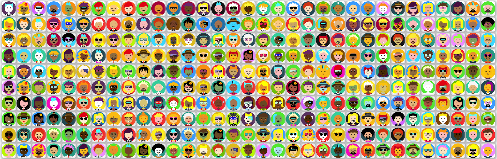

# CryptoAvatar.me

CryptoAvatar - 让 NFT 世界变得更美好。 在加密世界中，它是 10000 个独特的头像。 Cryptoavatar的灵感来自多娃娃，头像生成器，个人资料图片创建者。 名称和单词与头像随机关联。 任何与真人的相似之处纯属巧合。

CryptoAvatar.me NFT - 常见问题（FAQ）
▶ 什么是 CryptoAvatar.me？
CryptoAvatar.me 是一个 NFT（不可替代令牌）集合。存储在区块链上的数字艺术品集合。
▶ 有多少 CryptoAvatar.me 代币？
总共有 1,018 个 CryptoAvatar.me NFT。目前 125 位所有者的钱包中至少有一个 CryptoAvatar.me NTF。
▶ 最昂贵的 CryptoAvatar.me 销售是什么？
出售的最昂贵的 CryptoAvatar.me NFT 是 CryptoAvatar #314。它于 2022-06-06（3 个月前）以 16 美元的价格出售。
▶ 最近卖出了多少 CryptoAvatar.me？
过去 30 天内售出了 19 个 CryptoAvatar.me NFT。
▶ CryptoAvatar.me 需要多少钱？
在过去 30 天里，最便宜的 CryptoAvatar.me NFT 销售额低于 8 美元，最高销售额超过 16 美元。CryptoAvatar.me NFT 的中位价格在过去 30 天内为 16 美元。
▶ 有哪些流行的 CryptoAvatar.me 替代品？
许多拥有 CryptoAvatar.me NFT 的用户还拥有 adamisnotsilly、 The Degenerate Devil、 Ranchy R和 chibizuki 官方。

