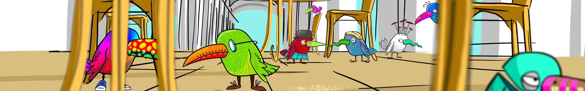

# Crypto Birds Cafe

由 SaraNmt 创建 - 经过多年寻找面包屑，最后，他们决定聚在一起创建自己的咖啡馆，加密鸟咖啡馆！ 使用 MATIC 直接从网站铸币：https://www.cryptobirdscafe.com/ https://opensea.io/Saranmt

Crypto Birds Cafe NFT - 常见问题（FAQ）
▶ 什么是 Crypto Birds 咖啡馆？
Crypto Birds Cafe 是一个 NFT（非同质代币）集合。存储在区块链上的数字艺术品集合。
▶ 存在多少 Crypto Birds Cafe 代币？
总共有 1,212 个 Crypto Birds Cafe NFT。目前，1,015 位业主的钱包中至少有一个 Crypto Birds Cafe NTF。
▶ 最近卖出了多少 Crypto Birds Cafe？
过去 30 天内共售出 0 个 Crypto Birds Cafe NFT。

