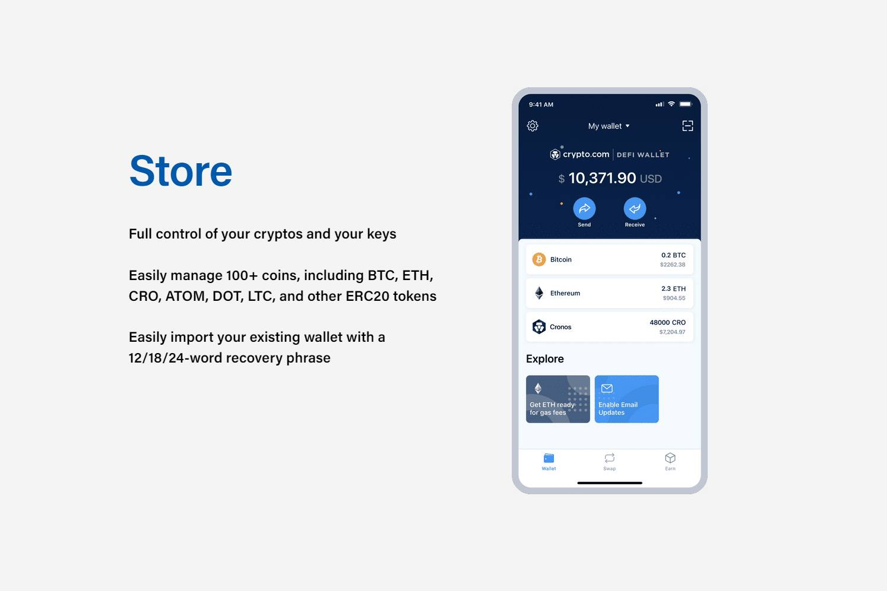

# Crypto.com DeFi Wallet

直接从您的 DeFi 钱包中种植和交换 DeFi 代币的最佳场所 &nbsp;流动性提供者享受选定矿池的交换费分享和红利收益一个非托管钱包，可让您在一个地方访问一整套 DeFi 服务。店完全控制您的加密货币和密钥 &nbsp;轻松管理 100 多种硬币，包括 BTC、ETH、CRO、ATOM、DOT、LTC 和其他 ERC20 代币 &nbsp;使用 12/18/24 轻松导入现有钱包-单词恢复短语发送以您喜欢的确认速度和网络费用发送加密货币赚
通过 Yearn Earn V2、Compound、Aave、Crypto.org Chain Staking 和 Cosmos Staking 赚取超过 35 种代币的利息 &nbsp;没有锁定期和丰厚的回报交换

