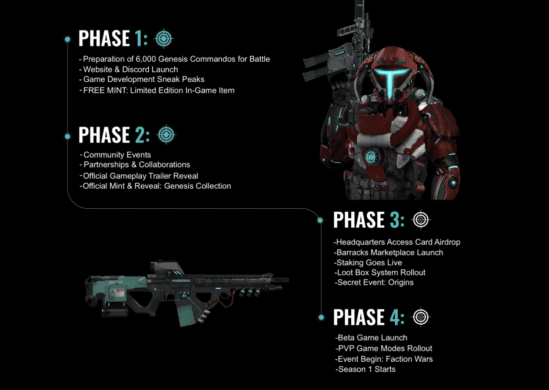

# Crypto Commandos Origins Collection

在宇宙大爆炸之后形成的第一颗行星，孕育了所有生命，泰拉炽热的核心锻造了阿兹米斯：一种天体元素，拥有远远超出理解的巨大力量。在过去的 10,000 年里，居住在这个星球上的是一个高度先进的个人社会，他们以其技术和军事实力而闻名，即突击队。Terah 隐藏宝藏的发现使突击队能够研究和利用其纯能量作为其城市、星际旅行和武器的重要动力来源。

没过多久，Terah 就在 MetaVerse 中确立了自己作为超级大国的地位，关于如何管理该元素的争论开始了。围绕该元素的使用方式的信念差异迅速爆发为暴力，随后发生了一场权力斗争，导致主要分裂为 4 个主要派系，被认为是“大分裂”。现在，各派系之间已经展开了一场战争，以期获得对 Terah 的完全控制权，你会为哪一方而战？

 
