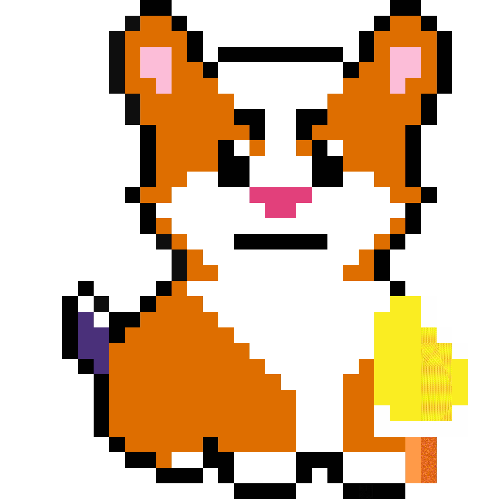

# Crypto Corgis

加密柯基犬在区块链上生存（和死亡）。节省了 1 万只柯基犬。随机生成，社区策划关于加密柯基犬加密柯基犬的属性来源于一个区块编号，只有最近的 256 个区块编号才能用于认领柯基犬。这意味着每一个新的区块，或者每 13 秒，新的柯基犬就会诞生，而旧的柯基犬则会死亡。共有15 个属性，共有 213个独特的特征，使 3,912,209,060,760,031 个可能的柯基犬。

有些柯基犬比其他柯基犬更稀有。注意31只独一无二的柯基犬。只能认领 10,000 只柯基犬。第一个柯基犬花费 0.001 ETH，最后一个 1.001 ETH。柯基犬每存活一个区块，就会从起始价格中获得0.003 ETH 的折扣。

