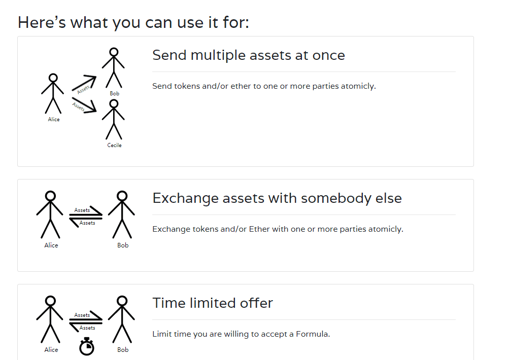

# Crypto Formulas

Crypto Formulas，一个直观的构建工具包，用于以太坊上的价值转移交互。[Crypto Formulas 智能合约的第一次更新已经发布。更新智能合约的动机是新的……Crypto Formulas 是一个构建工具包，用于使用基于以太坊的资产运行的简单而强大的程序，称为 Formulas。您可以轻松创建、共享或克隆满足您需求的现有公式。编写直观的指令，例如*从甲方向乙方发送以太币、添加时间约束、从甲方向乙方发送 ERC721 令牌*等，以涵盖以太坊用户经常遇到的许多不同用例。以原子方式向一方或多方发送代币和/或以太币。

