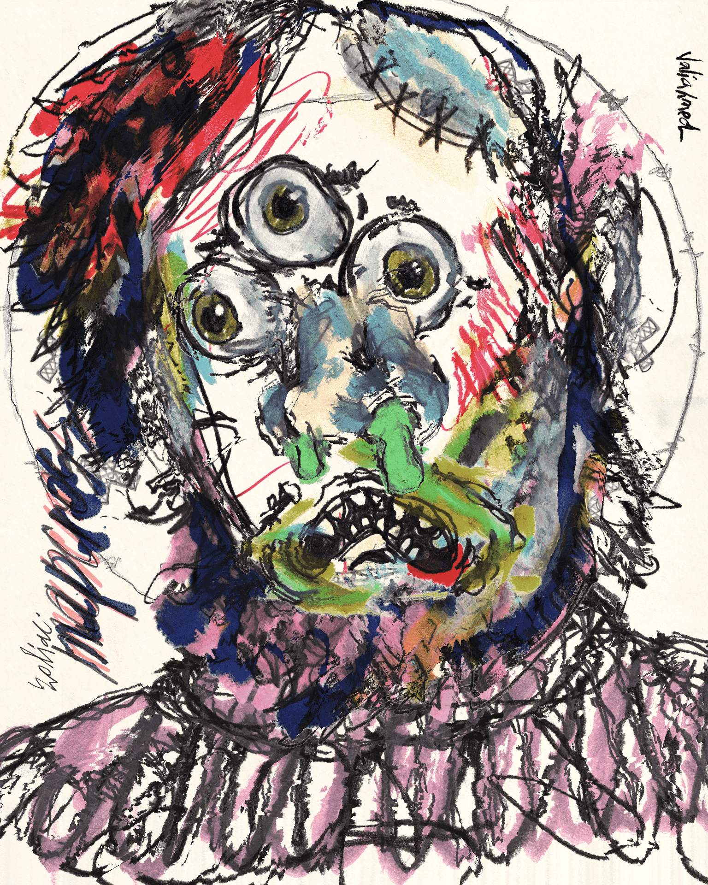

# Crypto Hobos

Crypto Hobos 宠物合作伙伴：第一个手工绘制的生成 NFT 项目，Crypto Hobos 融合了 NFT 空间的美术和个人资料图片类型。艺术家 Valiahmed Popov 破坏了构成该项目的 200 多个特征的源画，因此 8000 个原始 Crypto Hobos 现在仅以 ERC-721 代币的形式存在于以太坊区块链上。我们相信每个 NFT 或加密投资者都是逃离现实世界的难民，以创造一个崭新的元宇宙。做出一个转折，我们将 quazy-real 角色放入一个黑暗的科幻世界。我们都只是...... CryptoHobos。有史以来最疯狂的 NFT 收藏！有史以来最疯狂的 NFT 收藏！8000 NFTS 由 200 多种特征组合而成，采用艺术家 Valiahmed Popov 发明的一种非常特殊的技术手绘而成。Crypto Hobos 以 ERC-721 代币的形式存在于以太坊区块链上。

