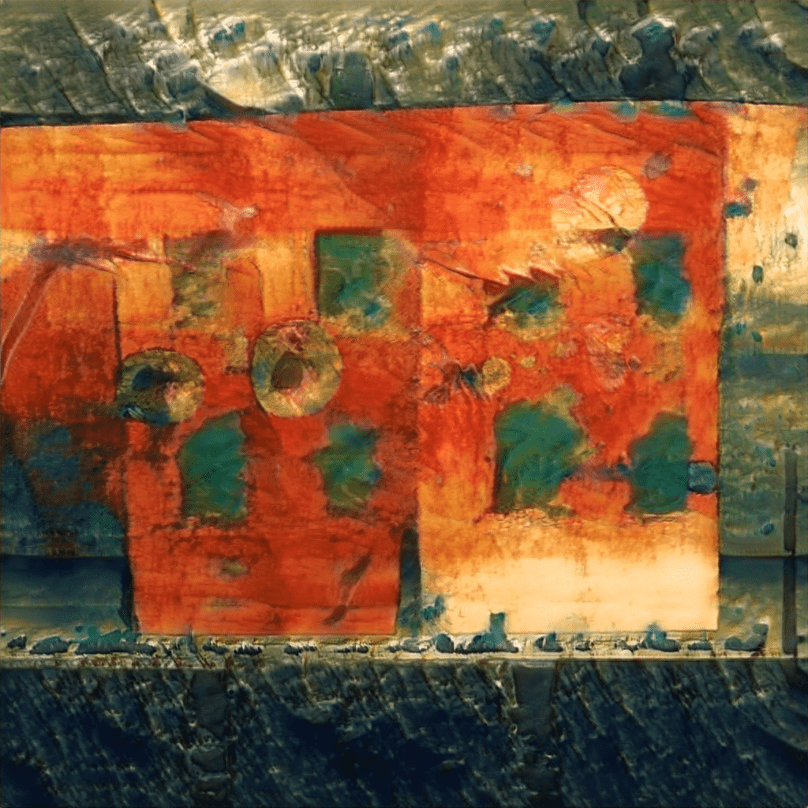

# Crypto-Native

来自 Mirage Gallery 的 Crypto-Native 不断发展的 NFT。如果你正在等待你的作品进化。请务必单击 OpenSea 上的“刷新元数据”按钮，等待，然后重新加载页面。演化规则是： 销售必须比任何以前的代币销售高 0.01 ETH。专业提示：捆绑销售不允许零件进化大多数 NFT 只是人们来回交易的 JPEG，有时会增值。如果收藏品是数字物品，它不应该包含一些动态方面吗？ 使用 Crypto-Native，艺术品会在二次销售发生时演变。这意味着您不仅可以来回交换相同的 JPEG，您还可以在 10 个演化阶段中拥有一个独特的步骤。 在 10 个进化阶段之后，每一块都将永远锁定在原位，并且无法恢复到任何较旧的阶段。哪个阶段最好？这完全是主观的，也是乐趣的一部分。有些人喜欢训练较少的艺术品，而另一些人可能喜欢更精致的版本。在 OpenSea 确认销售之前，没有人会知道下一阶段会是什么样子。收藏家的仪表板即将推出！薄荷在 10 分钟内售罄。如果你想捡一块。单击下面的按钮并前往 OpenSea 集合！

