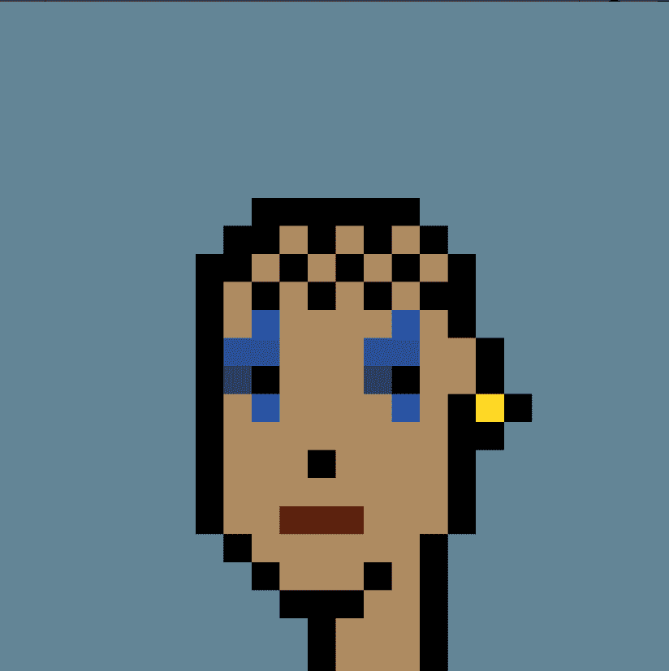

# CryptoPhunks

访问社区构建的 0% 费用市场：[https ://NotLarvaLabs.co不隶属于幼虫实验室。欢迎来到第一个（字面）NFT Flippening。CryptoPhunks 面朝左，因为另一种方式感觉不对。常见问题 (FAQ)

 

问：什么是 CryptoPhunk（又名 Phunk）？

A：Phunks 是一种植根于概念艺术的 NFT。对 CryptoPunks 的评论是正确的。Phunks 像蒙娜丽莎一样左脸。

问：是否参与了原始开发人员？

答：没有开发人员。创建合同、Cryptophhunks.com 网站以及相关的 Twitter 和 Discord 帐户的团队于 7 月公开离开了该项目。从那以后，他们就再也没有联系过。

问：谁运行 CryptoPhunks？

答：CryptoPhunks 是一个完全去中心化的社区，没有领导者。任何人都可以自由贡献。不需要批准。我们自主运行。

问：NotLarvaLabs.com 是什么？

答：一个社区建立的市场，用于销售基于我们自己的自定义智能合约构建的 CryptoPhunks。

问：在 NotLarvaLabs.com 上销售的费用是多少？

答：0％的版税！0%服务！成为Phree！

