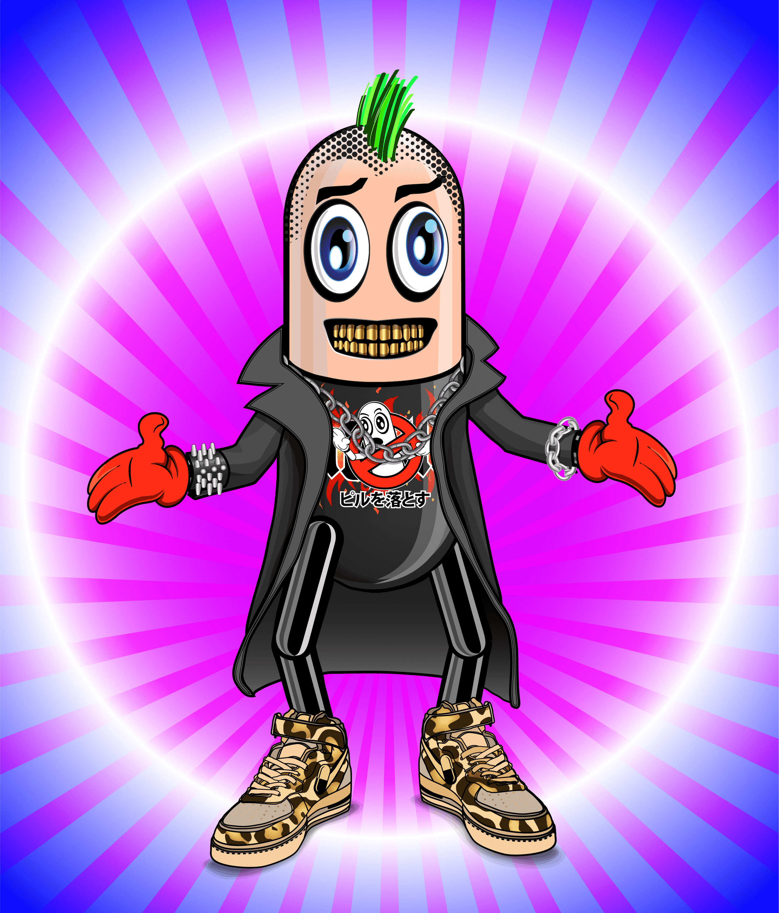

# Crypto-Pills by Micha Klein

病态社会的虚拟医学！从实验室逃出，从面包车上掉下来，从医生那里得到，或者在柜台上；Crypto-Pills 在这里让您开心！10,000 个独特的角色（基于 Micha Klein 臭名昭著的 Pillman 角色，Eminem 于 2000 年首次巡回演出），由算法生成并存在于区块链上。它们都特别适合治愈你的 FOMO，但有些比其他的更罕见。的 Crypto-Pill 兼作您的 Crypto-Pills 药房会员卡，并授予会员专属福利。Crypto Pills 是一个有限的 NFT 集合......有些是从实验室逃出来的；一些是从货车上掉下来的；其他是由医生开的；或者干脆在柜台买。所有 10,000 个 Crypto Pills 都是从 37 个类别和 504 个特征通过算法生成的，因此有些比其他的更稀有。Crypto-Pill 的所有功能均由 2021 年纽约市数字 NFT 艺术家奖的获得者创建；米查克莱因。它们是多性别、多颜色的，基于 Micha 臭名昭著的 Pillman 角色 Eminem 在 2000 年首次巡回演出。

