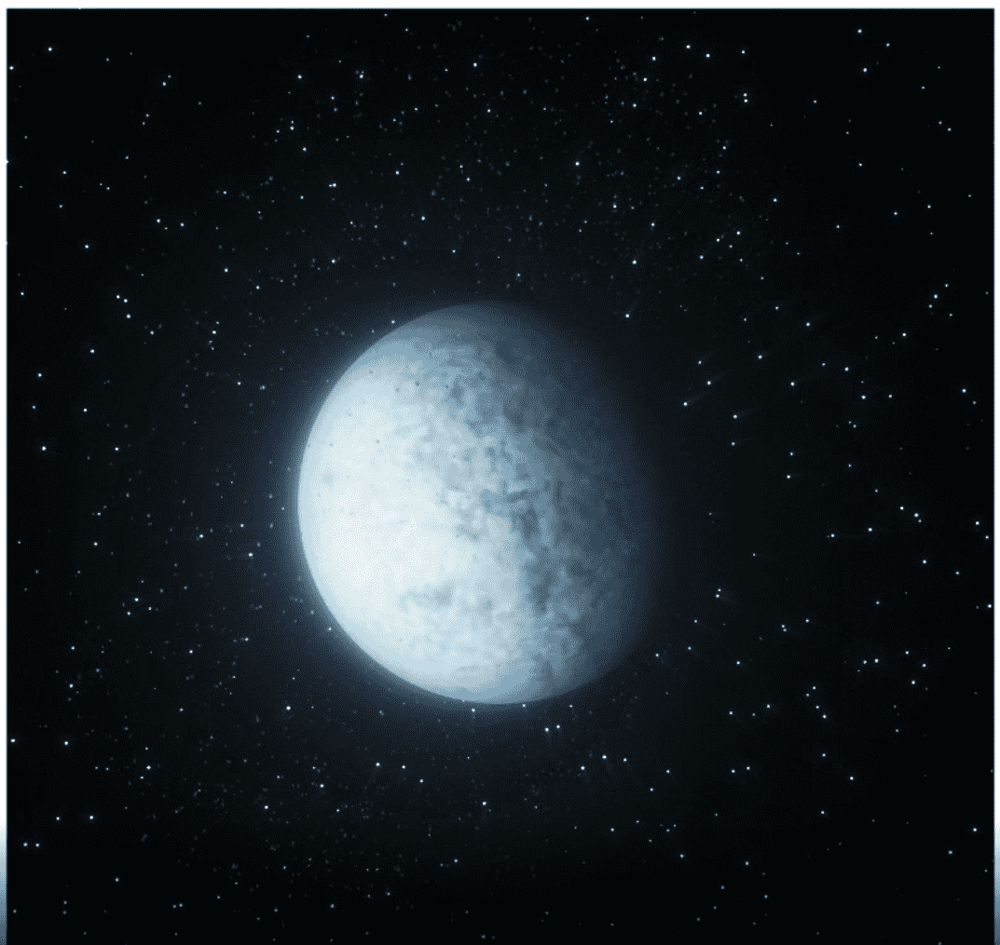

# Crypto Planets

一次探索一个星球，探索宇宙。Crypto Planets 是一个有限的 3D 项目，包含 150 个独特的副本。每个星球都是独一无二的，并以 1/1 版本出售。一次探索一个星球，探索宇宙。这是我们的 150 颗行星。 你更倾向哪个？

Crypto Planets NFT - 常见问题（FAQ）▶ 什么是加密行星？Crypto Planets 是一个 NFT（不可替代代币）集合。存储在区块链上的数字艺术品集合。▶ 存在多少 Crypto Planets 代币？总共有 150 个 Crypto Planets NFT。目前 70 位所有者的钱包中至少有一个 Crypto Planets NTF。▶ 最近卖出了多少加密星球？过去 30 天内共售出 0 个 Crypto Planets NFT。

