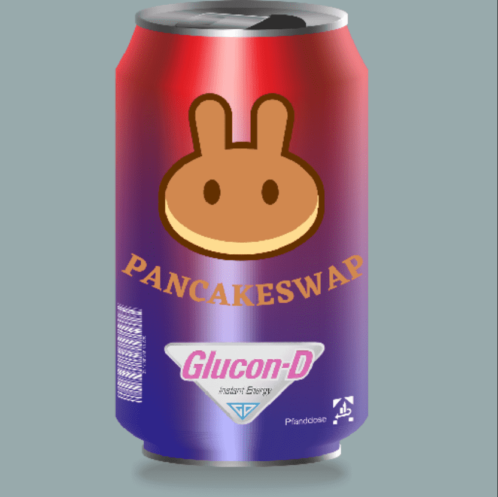

# Crypto Soda Cans

Crypto Soda Cans 是 8,000 个独特的 NFT 的集合 - 一个在全球流行的可收藏苏打罐的数字版本。拥有超过 10 种变体和无穷无尽的特征组合，每个 Soda can NFT 都包含一个可验证的稀有和独特的艺术品。持有苏打水可以让您获得团队未来的掉落，以及 CRYPTOSODA CLUB 扩展的所有访问通行证。是 8,000 个独特 NFT 的集合 - 一个在全球流行的可收藏苏打罐的数字版本。基于 Polygon 网络的 8000 个汽水罐的独特集合现在在 Opensea 上运行。看看[Crypto Soda Cans 是 8,000 个独特的 NFT 的集合 - 一个在全球流行的可收藏苏打罐的数字版本。拥有超过 10 种变体和无穷无尽的特征组合，每个 Soda can NFT 都包含一个可验证的稀有和独特的艺术品。持有苏打水可以让您获得团队未来的掉落，以及 CRYPTOSODA CLUB 扩展的所有访问通行证。

