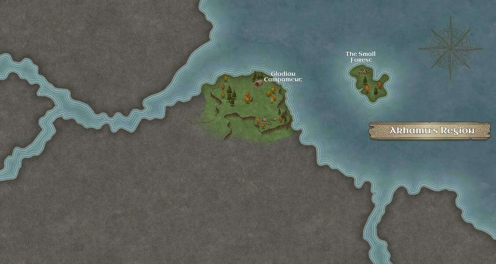

# CryptoAdventuresWorld Characters

故事开始！我们的英雄是一个精灵，他在森林中醒来，渴望进行新的冒险。我们的英雄将前往 Gladian 营地，逃离迷宫，在那里他将帮助其他生物：半人马、LongLongAnimal 和幽灵。**战利品制造系统**允许您在它们之间构建两个战利品 的完美战利品切换元素。当你使用这个系统时，你并不是在制作新的 NFT，而是这个系统自己转换了 NFT。为了更好地理解这一点，我们将分析冒险家的战利品。每个冒险家战利品都有 17 个物品（您可以查看下图）。这些物件有不同的稀有度，你可以在 opensea 属性上查看，例如，传奇物件就比较少见。 **所以使用这个工具你可以制作一个更奇怪的冒险家战利品**，也许是一个完整的传奇套装。

