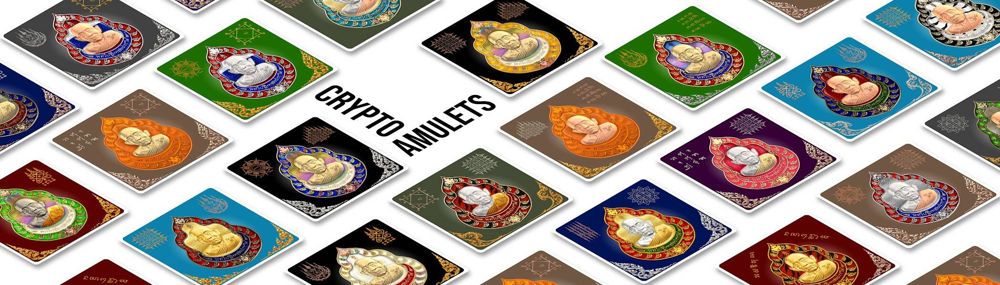

# CryptoAmulets

**CryptoAmulets**是 1680 个 NFT，得到上师 LP Heng 的加持，为它们的主人带来祝福和好运！

LP Heng 生于 1927 年 8 月 11 日，居住在泰国素林府的 Wat Pattana Thammaram，是咒语和魅力的大师。

智能合约、艺术品和 NFT 于 2021 年 6 月 9 日由 LP Heng 加持。10000 件独特的神圣收藏品由 LP Somsak 和 LP Heng 加持,所有者对其 NFT 的完全控制和无限商业权利

这是第一次将泰国护身符作为 NFT 收藏品引入以太坊智能合约。适合您收藏的永恒和历史作品。所有 CryptoAmulets NFT 都经过
了系列分别由僧侣主持的加持仪式。

