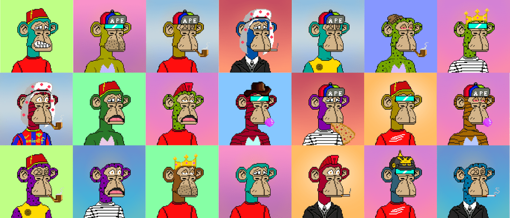

# Crypto Ape Polygon Club

我们是谁？加密猿多边形俱乐部！-我们为什么在这里？购买原装 NFT BAYC！-这个怎么运作？-1.м我们将购买流行收藏的原始NFT
2.这些NFT将成为CAPC社区的共同财产。该系列也在 TofuNFT 上交易：https ://tofunft.com/collection/crypto-ape-polygon-club免责声明：此系列与 BORED APE 游艇俱乐部（BAYC）无关,▶ 什么是加密猿多边形俱乐部？
Crypto Ape Polygon Club 是一个 NFT（非同质代币）集合。存储在区块链上的数字艺术品集合。
▶ 有多少 Crypto Ape Polygon Club 代币？
总共有 10,232 个 Crypto Ape Polygon Club NFT。目前，241 位所有者的钱包中至少有一个 Crypto Ape Polygon Club NTF。
▶ 最近卖出了多少 Crypto Ape Polygon Club？
过去 30 天内共售出 0 个 Crypto Ape Polygon Club NFT。

