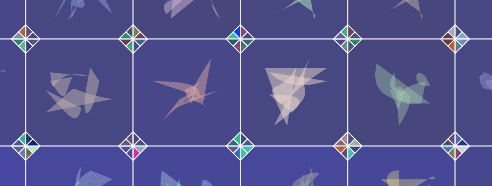

# CryptoArte

CryptoArte 是 2018 年的 NFT 和生成艺术收藏品，将以太坊区块链历史投射到色彩缤纷、独特且有意义的画作中。每个代币代表一幅给定的画作，并匹配其链上哈希。代币所有者可以下载他们绘画的 8K 分辨率数字图像并订购签名，准备在 cryptoarte.io 上挂画。

CryptoArte 是一个多学科项目，将以太坊网络、艺术收藏品、不可替代的代币和去中心化应用程序融合在一起。

CryptoArte 系列目前包括 9,895 幅独特的单版画作。每幅画通过形状、颜色、装饰等有意义的组合代表了以太坊区块链的 576 个连续区块（参见[画作](https://www.cryptoarte.io/about#paintings)）。

例如，[绘画#0](https://www.cryptoarte.io/paintings/0)是块 0（创世块）到 575 的艺术表示。[绘画#1](https://www.cryptoarte.io/paintings/1)从块 576 到块 1,151，依此类推。

这些画作是通过对公开可用的以太坊区块链信息进行数学转换而创作的。转换是确定性的，所有画作都是一样的。

因此，该系列通过将几个数据点和统计数据（例如：交易量、区块矿工等）投影到彩色画中来说明以太坊区块链的历史。

