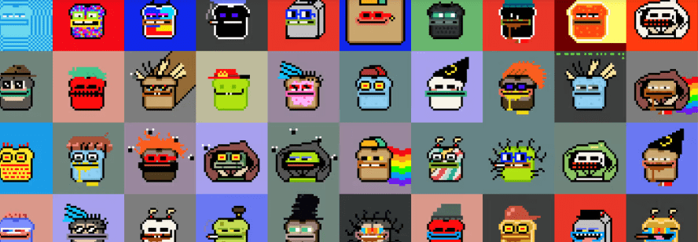

# CrypToasts NFT

不可替代代币 (NFT) 是区块链上与特定数字或实物资产相关联的记录。 NFT 的所有权记录在区块链中，并且可以由所有者转让，从而允许 NFT 被出售和交易。

NFT 可以由任何人创建，并且需要很少或不需要编码技能来创建。[[2\]](https://en.wikipedia.org/wiki/Non-fungible_token#cite_note-2) NFT 通常包含对[数字文件](https://en.wikipedia.org/wiki/Digital_file)的引用，例如照片、视频和音频。由于 NFT 是唯一可识别的资产，因此它们不同于可[替代的](https://en.wikipedia.org/wiki/Fungibility)[加密货币](https://en.wikipedia.org/wiki/Cryptocurrencies)。

NFT 的支持者声称 NFT 提供了公开[的真实性](https://en.wikipedia.org/wiki/Certificate_of_authenticity)证明或[所有权证明](https://en.wikipedia.org/wiki/Title_(property))，但 NFT 所传达的合法权利可能不确定。区块链定义的 NFT 所有权没有内在的法律意义，并不一定授予其相关数字文件的[版权](https://en.wikipedia.org/wiki/Copyright)、[知识产权](https://en.wikipedia.org/wiki/Intellectual_property)或其他合法权利。NFT 不限制其相关数字文件的共享或复制，也不阻止创建引用相同文件的 NFT。

