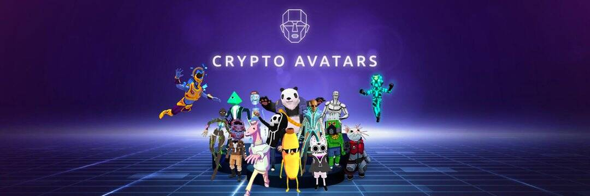

# CryptoAvatars

可互操作的 3D 化身平台，用于创建、销售和交易 NFT 化身。头像是以太坊或多边形 (Matic) 链上的 VRM 文件和单一版本令牌。我们平台中的所有头像均已获得许可，因此任何人都可以访问其中的一些头像（开源 - CC0）。我们为 VRChat、Decentraland、The Sandbox、Webaverse 等 Metaverse 平台带来了虚拟形象互操作性，以及更多即将推出的平台。也可以将它们用于 Vtubing 和视频通话！收集独特的 虚拟现实 头像

CryptoAvatars 让人们可以购买 3D 化身作为 NFT，并在多个虚拟世界和 Zoom 等流媒体应用程序中使用它们。

